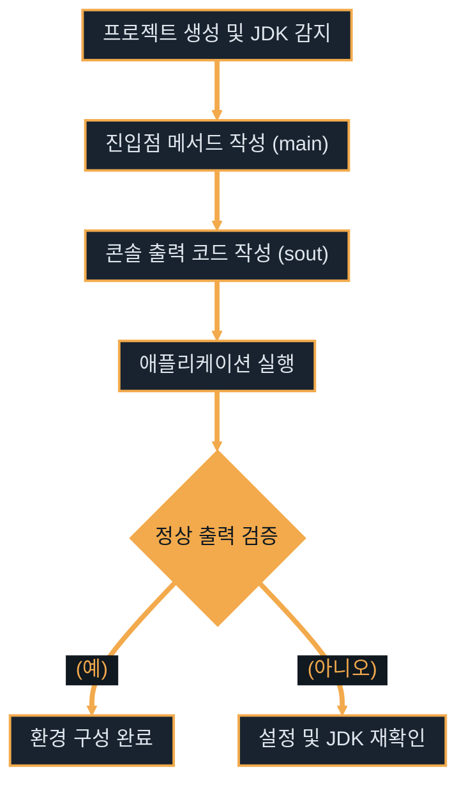

# 자바 백엔드 개발 환경 구축

---
layout: default
---

# 학습 체크리스트

- [ ] IntelliJ IDEA의 경쟁력과 에디션별 차이 이해
- [ ] OpenJDK 배포판 특징 분석 및 Java 17+ 기준 수립
- [ ] 개발 생산성을 높이는 필수 단축키와 IDE 초기 세팅 숙달
- [ ] 코딩 편의성을 극대화하는 에디터 옵션 및 추천 플러그인 구성

---
layout: default
---

# 통합 개발 환경 (IDE) 이해

> **통합 개발 환경 (Integrated Development Environment)**
>
> 코드 작성, 빌드, 디버깅, 배포 등 소프트웨어 개발에 필요한 모든 도구를 하나로 결합한 소프트웨어 애플리케이션

- **단일 작업 공간**: 편집기, 컴파일러, 디버거를 유기적으로 연동하여 관리
- **개발 흐름 단축**: 개별 도구 호출에 소요되는 설정과 시간 최소화
- **정적 분석 제공**: 작성 중인 코드의 잠재적 컴파일 오류를 실시간 탐지

---
layout: default
---

# IDE 삼파전 비교

| 비교 항목                 | VSCode                      | Eclipse (STS)                 | IntelliJ IDEA                     |
| :------------------------ | :-------------------------- | :---------------------------- | :-------------------------------- |
| **Java 전용 여부**        | 범용 (확장 플러그인 필요)   | 전용 (Java/Spring 중심)       | 전용 (JVM 생태계 최적화)          |
| **초기 설정 편의성**      | 플러그인 개별 세팅 필요     | 비교적 복잡한 설정 필요       | JDK 자동 감지 등 즉시 시작 가능   |
| **정적 분석 및 자동완성** | 보통                        | 보통 (상대적 스마트함 부족)   | 압도적 (지능형 분석 및 리팩토링)  |
| **대규모 프로젝트 성능**  | 무거워지거나 빌드 지연 발생 | 성능 저하 및 잦은 프리징 현상 | 캐싱 및 성능 최적화로 안정적 작동 |

---
layout: default
---

# IntelliJ IDEA의 핵심 가치

- **자체 런타임 구성**: JDK 자동 감지 및 즉시 다운로드 기능 제공
- **수동 연동 불필요**: Tomcat 등 외부 웹 WAS 연동 없이 IDE 내 독립 실행 지원
- **스마트 자동완성**: 컨텍스트를 분석하여 가장 적절한 코드 완성 후보 제안
- **안전한 일괄 리팩토링**: 레퍼런스 깨짐 없이 안전한 클래스/메서드 이름 변경 지원
- **실무 글로벌 표준**: 대부분의 현대 자바 백엔드 기업에서 표준 도구로 채택

---
layout: default
---

# IntelliJ 에디션 비교

- **Community 에디션 (무료)**
  - 오픈소스 버전으로 Java, Kotlin 개발의 기본 기능 충실히 지원
  - 빌드 도구(Gradle, Maven) 및 Git 연동 기능 제공
  - Spring Boot, JPA, 내장 데이터베이스 도구 등 기업형 프레임워크 지원 배제
- **Ultimate 에디션 (유료)**
  - Spring Boot 및 JPA 개발 완벽 지원 및 코드 자동 완성 고도화
  - Database Tools 내장으로 외부 DB 클라이언트 설치 없이 테이블 관리
  - 대학생의 경우 학교 이메일 인증으로 학생 라이선스 무료 발급 가능

---
layout: default
---

# 자바 개발 키트 (JDK) 개요

> **자바 개발 키트 (Java Development Kit)**
>
> 자바 프로그램을 개발하고 실행하기 위해 필요한 컴파일러(javac), 런타임 환경(JRE), 디버거 등을 모아놓은 소프트웨어 패키지

- **스펙과 구현체**: Java SE 스펙에 따라 구현된 다양한 배포판이 존재
- **오픈소스 기반**: 기본적으로 OpenJDK라는 오픈소스 프로젝트를 기준으로 발전
- **배포판 선택 기준**: 라이선스 정책, 클라우드 환경 및 안정성을 고려하여 선택

---
layout: default
---

# OpenJDK 배포판 종류와 특징

- **Oracle JDK**
  - 오라클 공식 배포판이나 상업적 목적 사용 시 과금 정책 세부 검토 필요
- **Eclipse Temurin (Adoptium)**
  - 오픈소스 재단 주도 배포판으로 높은 안정성과 강력한 호환성 덕에 표준으로 추천
- **Amazon Corretto**
  - AWS 환경에 최적화되고 검증을 완료하여 AWS 클라우드 배포 시 최고의 궁합 자랑
- **Azul Zulu**
  - 임베디드, 가상화, 클라우드 등 다양한 컴퓨팅 아키텍처를 폭넓게 지원하는 안정적 배포판

---
layout: default
---

# Spring Boot 3.0과 JDK 버전 기준

- **최소 요구 버전**: Spring Boot 3.0 이상 버전부터는 최소 **Java 17 이상** 필수 요구
- **상위 버전 트렌드**: 자바의 LTS(Long Term Support) 로드맵에 맞추어 Java 17/21 전환 가속
- **신규 기능 도입**: Java 17+의 레코드(Record), 텍스트 블록(Text Blocks) 등 모던 스펙 활용 가능
- **백엔드 권장 사항**: 레거시(Java 8/11) 유지보수가 아닌 신규 개발 시 Java 17+을 기준 버전으로 권장

---
layout: default
---

# 개발 환경 검증 흐름도



---
layout: default
---

# 자바 애플리케이션 진입점 설계

- **진입점(Entry Point)**: JVM이 프로그램을 시작할 때 호출하는 `main` 메서드
- **시작 제어**: `public static void main(String[] args)` 선언으로 시작 흐름 정의
- **IntelliJ 단축어(Live Template)**:
  - `main` 입력 후 탭 또는 엔터로 진입점 자동 생성
  - `sout` 입력 후 탭 또는 엔터로 콘솔 출력문(`System.out.println()`) 생성

---
layout: default
---

# 표준 출력 테스트 클래스 정의

```java
public class HelloWorld {
    public static void main(String[] args) {
        System.out.println("Hello World!");
    }
}
```

---
layout: default
---

# 생산성을 높이는 핵심 단축키

| 기능          | Mac         | Windows / Linux      | 설명                                        |
| :------------ | :---------- | :------------------- | :------------------------------------------ |
| **전체 검색** | `Double ⇧`  | `Double Shift`       | 파일, 클래스, 메서드, 설정까지 통합 검색    |
| **액션 검색** | `⌘ + ⇧ + A` | `Ctrl + Shift + A`   | 원하는 메뉴나 설정 명령어를 타이핑하여 실행 |
| **코드 완성** | `⌃ + Space` | `Ctrl + Space`       | 기본 코드 자동 완성 후보 표시               |
| **빠른 실행** | `⌃ + ⇧ + R` | `Ctrl + Shift + F10` | 현재 활성화된 진입점 클래스 파일 실행       |

---
layout: default
class: text-sm-slide
---

# 코드 편집 및 최적화 단축키

| 기능               | Mac         | Windows / Linux  | 설명                                                  |
| :----------------- | :---------- | :--------------- | :---------------------------------------------------- |
| **빠른 수정**      | `⌥ + Enter` | `Alt + Enter`    | 컴파일 에러 해결 및 자동 import 추천                  |
| **코드 포맷 정렬** | `⌘ + ⌥ + L` | `Ctrl + Alt + L` | 지정된 코드 스타일 규칙에 맞춰 일괄 개행/공백 포맷팅  |
| **임포트 최적화**  | `⌃ + ⌥ + O` | `Ctrl + Alt + O` | 사용하지 않는 import 패키지 제거 및 정렬              |
| **이름 일괄 변경** | `⇧ + F6`    | `Shift + F6`     | 변수, 클래스 등 모든 레퍼런스를 추적해 이름 일괄 수정 |
| **최근 파일 보기** | `⌘ + E`     | `Ctrl + E`       | 최근 열었던 파일 목록을 조회하여 빠른 탭 이동         |

---
layout: default
---

# 내장 터미널 및 GitHub 연동 설정

- **Windows 터미널 Git Bash 연동**
  - 기본 터미널 `cmd.exe` 대신 `Git Bash`를 연동해 리눅스 명령어 환경 활용
  - 설정 경로: *Settings → Tools → Terminal → Shell path*
  - 경로 변경: `C:\Program Files\Git\bin\bash.exe`로 경로 지정
- **IDE 내 GitHub 계정 연동**
  - 원격 저장소 클론, 커밋, 푸시 및 Pull Request 관리 가능
  - 설정 경로: *Settings → Version Control → GitHub → Add Account*

---
layout: default
---

# JVM 힙 메모리 최적화 설정

- **설정 목적**: 대규모 빌드 및 에디터 로딩 시 발생하는 메모리 병목과 프리징 차단
- **수행 방법**: *Help → Change Memory Settings* 실행 후 힙 공간 재조정 (저장 후 재시작)

| PC RAM 용량      | 힙 메모리 추천 범위 | 대상 환경                                      |
| :--------------- | :------------------ | :--------------------------------------------- |
| **8 GB**         | `1024 MB ~ 2048 MB` | 가벼운 개인 프로젝트용                         |
| **16 GB (권장)** | `2048 MB ~ 4096 MB` | Spring Boot 및 데이터베이스 병렬 작업 표준     |
| **32 GB 이상**   | `4096 MB ~ 8192 MB` | 대형 모노레포 및 마이크로서비스(MSA) 로컬 환경 |

---
layout: default
---

# 에디터 편의 및 가독성 설정 (1/2)

- **Soft Wrap (자동 줄바꿈)**
  - 가로 스크롤 없이 에디터 폭에 맞춰 코드 자동 개행
  - 설정 경로: *Settings → Editor → General → 'Soft-wrap these files' 체크*
- **Auto Import (실시간 자동 임포트)**
  - 수동 패키지 import 번거로움을 생략하고 삭제 시 실시간 정제
  - 설정 경로: *Settings → Editor → General → Auto Import*
  - 상세 설정: `Add unambiguous imports on the fly`, `Optimize imports on the fly` 둘 다 체크

---
layout: default
---

# 에디터 편의 및 가독성 설정 (2/2)

- **줄 번호 표시 (Show line numbers)**
  - 디버깅 시 에러 트레이스 추적 및 코드 리뷰 효율성 향상
  - 설정 경로: *Settings → Editor → General → Appearance → 'Show line numbers' 체크*
- **공백 문자 표시 (Show whitespaces)**
  - 탭과 스페이스 간의 불일치 현상을 직관적으로 감지하여 서식 오류 예방
  - 설정 경로: *Settings → Editor → General → Appearance → 'Show whitespaces' 체크*
- **마우스 휠 줌 (Change font size with ⌘/Ctrl+Wheel)**
  - 맥 트랙패드 줌 및 윈도우 마우스 휠 동작을 통해 실시간 폰트 크기 동적 조절
  - 설정 경로: *Settings → Editor → General → 'Change font size with ⌘+Mouse Wheel' [Mac] / 'Ctrl+Mouse Wheel' [Win] 체크*

---
layout: default
---

# 코드 스타일 및 Actions on Save 설정

- **코드 스타일 규칙 적용**
  - 설정 경로: *Settings → Editor → Code Style → Java (또는 각 주 사용 언어)*
  - 상세 설정: `Tab size`는 `4` 유지 (웹 언어는 `2` 권장), `Use tab character` 체크 해제
- **Actions on Save (저장 시 자동 포맷팅)**
  - 저장 시점에 코드 줄맞춤과 임포트 정리를 자동화하여 커밋 전 불필요한 공백 변경 방지
  - 설정 경로: *Settings → Tools → Actions on Save*
  - 상세 설정: `Reformat code` 및 `Optimize imports` 둘 다 체크

---
layout: default
---

# 폰트 크기 및 UI 폰트 최적화

- **에디터 폰트 (Editor Font)**
  - 가독성 높은 코딩 전용 폰트 적용
  - 설정 경로: *Settings → Editor → Font*
  - 추천 설정: Font `JetBrains Mono` 지정, 크기 `14 ~ 16`, 줄 간격(Line height) `1.2 ~ 1.4`
- **UI 폰트 (UI Font)**
  - 장시간 작업 시 발생할 수 있는 시각 피로도를 경감하기 위해 조정
  - 설정 경로: *Settings → Appearance & Behavior → Appearance*
  - 추천 설정: `Use custom font` 체크 후 크기를 `13 ~ 14`로 조정 (기본 12 대비 시인성 우수)

---
layout: default
---

# 개발 효율을 높이는 플러그인

- **AI 코딩 도구**
  - **JetBrains AI Assistant**: 공식 클라우드 기반 코드 자동완성 및 리팩토링 제안
  - **Gemini Code Assist**: 구글의 AI 코딩 비서로 다양한 자바 연동 및 코드 자동 생성
- **에디터 유틸리티**
  - **Atom Material Icons**: 기본 아이콘을 세련되고 구분이 명확한 머티리얼 아이콘으로 변경
  - **Rainbow Brackets**: 중첩 괄호쌍 마다 고유 색상을 매핑해 괄호 짝을 쉽게 식별
  - **Translation**: 에디터 내부에서 주석 및 영어 에러 메시지를 한글로 즉시 번역
  - **CodeGlance Pro**: 에디터 우측 미니맵을 통해 전체 파일의 특정 위치로 고속 이동


