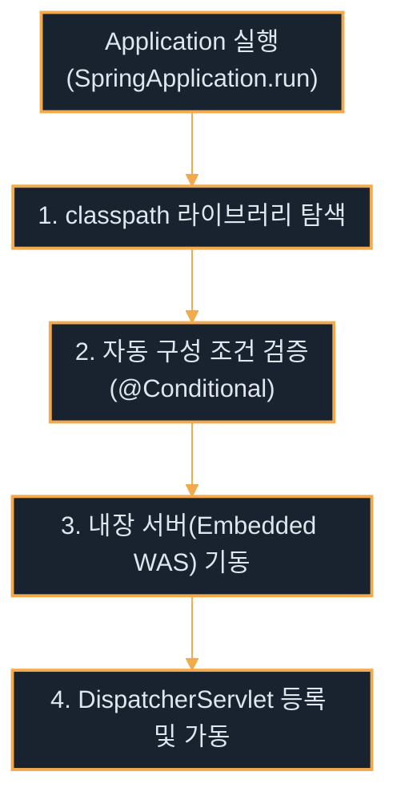

# Spring Boot

---
layout: default
---

# 학습 체크리스트 (1/2)

- [ ] Spring Boot의 개념 및 핵심 철학(Auto Configuration) 이해
- [ ] Spring Boot 주요 버전별(1.x ~ 4.x) 변화 및 특징 파악
- [ ] Spring Framework와 Spring Boot의 핵심 차이점 숙지
- [ ] Spring Initializr 및 Starter를 활용한 프로젝트 구성 방법 습득

---
layout: default
---

# 학습 체크리스트 (2/2)

- [ ] 메인 클래스의 올바른 패키지 위치 및 컴포넌트 스캔 동작 방식 숙지
- [ ] 기존 스프링 설정(Config)의 자동 구성 대체 및 다이어트 메커니즘 이해
- [ ] application.properties를 통한 웹 설정 및 JSP 연동 제약사항 학습

---
layout: cover
class: text-center
---

# Spring Boot 개요 및 주요 버전

---
layout: default
---

# Spring Boot 개요

> **스프링 부트 (Spring Boot)**
>
> 스프링 프레임워크 기반 애플리케이션을 복잡한 XML/Java 설정 없이 "실행만 하면 되는(Just Run)" 상태로 신속히 구축하도록 돕는 상위 프레임워크

- **핵심 철학**: Opinionated(주관적인) 설정 방식을 채택하여 합리적인 디폴트값 적용
- **자동 구성 (Auto Configuration)**: 일반 프로젝트에 필요한 빈과 설정을 자동으로 구성
- **생산성 극대화**: 개발자가 인프라 설정 대신 비즈니스 로직에만 집중할 수 있게 지원

---
layout: default
---

# 밀키트 (Meal Kit) 관점으로 이해하는 Spring Boot

- **전통적인 요리 (Spring Framework)**:
  - 마트에서 고기, 채소, 소스를 각각 구매하고 손질해야 함
  - 각 재료의 양과 불의 세기, 조리 시간을 수동으로 세밀하게 맞추는 복잡한 과정
- **밀키트 조리 (Spring Boot)**:
  - 검증된 요리사의 레시피대로 손질된 재료와 맞춤 소스가 한 팩에 포장되어 제공됨
  - 팩을 뜯고 냄비에 넣어 **"단지 끓이기만 하면(Just Run)"** 동일한 맛의 요리 완성
- **동작 매핑**:
  - `재료 개별 구매` $\rightarrow$ 수동 의존성 버전 매칭 및 XML/자바 설정
  - `밀키트 팩` $\rightarrow$ Spring Boot Starter 의존성 및 자동 구성(Auto Configuration)

---
layout: default
---

# Spring Boot 버전 로드맵 (1.x ~ 2.x)

- **Spring Boot 1.x (Java 6/7, Spring 4 기반)**:
  - 스프링 부트의 효시이자 XML 설정을 배제하는 자바 코드 중심 설정 체계 도입
  - 내장 톰캣(Embedded Tomcat)을 통한 단독 실행 및 편리한 의존성 관리 기틀 마련
- **Spring Boot 2.x (Java 8, Spring 5 기반)**:
  - Java 8의 함수형 기능을 표준으로 수용하며 리액티브 프로그래밍(WebFlux) 도입
  - Actuator 모니터링 고도화 및 다방면의 의존성 관리 표준화

---
layout: default
---

# Spring Boot 버전 로드맵 (3.x ~ 4.x)

- **Spring Boot 3.x (Java 17 최소 요구, Spring 6 기반)**:
  - Jakarta EE 9/10 스펙 (`javax.*` -> `jakarta.*`)으로의 대대적 패키지 전환 완료
  - 가상 스레드(JDK 21+) 지원 및 GraalVM AOT를 이용한 네이티브 이미지 빌드 지원
- **Spring Boot 4.x (Java 17 최소 요구, Spring 7 기반)**:
  - Jakarta EE 11 지원 및 코드베이스 모듈화를 통한 성능 최적화와 시작 시간 단축
  - JSpecify 어노테이션의 전면 도입을 통해 컴파일 타임의 Null-Safety 검증 대폭 강화

---
layout: cover
class: text-center
---

# Spring vs Spring Boot 핵심 차이

---
layout: default
---

# Spring vs Spring Boot (1) 의존성과 설정

| 비교 항목 | Spring Framework | Spring Boot |
| :--- | :--- | :--- |
| **의존성 관리 (Dependency)** | 개발자가 필요한 라이브러리 버전들을 수동 매칭하여 직접 Maven/Gradle에 일일이 선언함. | `spring-boot-starter` 모듈을 통해 목적에 맞는 라이브러리 세트를 버전 충돌 없이 일괄 관리함. |
| **설정 방식 (Configuration)** | `web.xml` 등 XML 파일이나 다수의 `@Configuration`에 빈 등록 및 설정을 수동으로 구현해야 함. | 클래스패스 라이브러리를 자동 감지하여 `@EnableAutoConfiguration`이 알아서 자동 구성함. |

---
layout: default
---

# Spring vs Spring Boot (2) 서버와 운영

| 비교 항목 | Spring Framework | Spring Boot |
| :--- | :--- | :--- |
| **내장 서버 (Embedded WAS)** | WAS가 자체 내장되어 있지 않아, 빌드된 WAR 파일을 외부 톰캣 등에 수동 배포해야 함. | Tomcat, Jetty 등이 JAR 내부에 빌트인되어 있어 `java -jar` 명령어로 단독 실행 가능함. |
| **운영 지원 (Actuator)** | 애플리케이션 헬스체크, 메트릭 수집 등을 위해 관련 모니터링 모듈을 매번 커스텀 구축해야 함. | `Spring Boot Actuator`를 탑재하여 내장 메트릭 정보를 표준 API 엔드포인트로 즉시 제공함. |

---
layout: cover
class: text-center
---

# Spring Boot 프로젝트 기동과 설정

---
layout: default
---

# Spring Initializr 프로젝트 생성

> **Spring Initializr (start.spring.io)**
>
> 스프링 부트 프로젝트의 표준 뼈대(Scaffolding) 구조를 웹에서 편리하게 생성해 주는 공식 도구

- **IntelliJ 통합 마법사**: 웹 브라우저뿐만 아니라 IntelliJ IDEA 내부 마법사와 연계하여 직접 구동 가능
- **쉬운 옵션 구성**: 빌드 도구(Maven/Gradle), 자바 버전, 부트 버전 및 라이브러리 의존성 선택
- **완성형 템플릿 제공**: 선택 완료 즉시 바로 빌드 및 컴파일이 가능한 스타터 프로젝트 폴더를 생성

---
layout: default
---

# Spring Boot Starter (의존성 번들)

> **스프링 부트 스타터 (Starter)**
>
> 특정 기능 개발에 필수적으로 요구되는 의존성 라이브러리 세트를 그룹화하여 제공하는 간편 패키지

- **의존성 복잡도 해결**: 여러 라이브러리의 호환 버전을 고민할 필요 없이 스타터 1개 등록으로 끝
- **버전 충돌 방지**: 스프링 부트가 각 라이브러리들 간의 호환이 검증된 최적의 버전을 일괄 제어
- **대표 예시 (`spring-boot-starter-web`)**:
  - `spring-webmvc` 및 Embedded Tomcat 내장 서버
  - Jackson (JSON 직렬화), SLF4J & Logback (로깅 모듈) 등 웹 필수 기술 자동 적재

---
layout: default
---

# Spring Boot 내장 WAS 및 자동 구성 구동 흐름



---
layout: default
---

# 메인 클래스 패키지 위치와 자동 스캔

> **컴포넌트 스캔 (Component Scan) 경로**
>
> `@SpringBootApplication`이 선언된 메인 클래스의 패키지가 Component Scan의 루트 시작 경로가 됨

- **자동 하위 검색**: 메인 클래스가 위치한 패키지와 그 하위 패키지에 존재하는 `@Component` 계열 빈만 감지됨
- **흔한 실수 (NoSuchBeanDefinitionException)**:
  - 메인 클래스를 특정 하위 패키지 깊숙이 두어 상위나 형제 패키지의 컨트롤러를 스캔하지 못하는 경우
- **올바른 배치**: 반드시 프로젝트의 기본 루트 패키지(예: `com.example.app`)에 메인 클래스를 위치시켜야 함

---
layout: default
---

# 복잡한 설정의 삭제와 애너테이션 대체

- **기존 Spring Web MVC의 수많은 설정**:
  - `web.xml` (서블릿 등록), `WebMvcConfigurer` (리소스 매핑)
  - `InternalResourceViewResolver` 빈 등록 및 `@EnableWebMvc` 수동 선언
- **Spring Boot의 극적인 다이어트**:
  - **`@SpringBootApplication`** 단 하나로 위의 모든 설정과 DispatcherServlet 등록 자동화
  - 자동 구성(Auto Configuration) 덕분에 대부분의 자바 설정 클래스(`@Configuration`)는 원천 삭제 가능
- **커스텀 오버라이딩**: 설정이 필요한 부분만 properties 파일이나 최소한의 Java Config로 덮어씀

---
layout: default
---

# application.properties 설정 파일

> **application.properties**
>
> 스프링 부트 애플리케이션의 핵심 동작 방식과 인프라 구성을 중앙 집중식으로 제어하는 설정 파일

- **중앙 설정 관리**: 포트, 데이터베이스 주소, 타임아웃, 로그 레벨 등 전체 환경 설정 통합
- **클래스패스 탐색**: 기본적으로 `src/main/resources/application.properties` 경로에 위치
- **자동 완성 지원**: 주요 스타터 라이브러리와 연관된 프로퍼티 키값의 자동 완성 기능을 IDE에서 제공

---
layout: default
---

## 웹 서버 구동 포트 및 경로 커스텀 설정

```properties
# 웹 서버 구동 포트 지정 (기본값: 8080)
server.port=8081

# 애플리케이션 루트 콘텍스트 경로 지정
server.servlet.context-path=/app
```

---
layout: cover
class: text-center
---

# Spring Boot와 JSP 연동 및 제약

---
layout: default
---

# Spring Boot가 JSP를 권장하지 않는 이유

- **Executable JAR 빌드의 구조적 한계**:
  - 스프링 부트의 표준 배포판인 Executable JAR 포맷 내부에서는 JSP 파일을 컴파일하고 서블릿 클래스로 변환하는 톰캣의 탐색 메커니즘이 완벽하게 지원되지 않음
  - JSP를 사용하려면 빌드 패키징 설정을 JAR가 아닌 **WAR** 방식으로 전환해야만 함
- **정적 리소스 매핑 충돌**:
  - JSP의 서버 사이드 렌더링 설정이 복잡해질수록 스프링 부트가 기본으로 지원하는 `src/main/resources/static` 경로의 정적 파일 자동 매핑 체계 및 뷰 해석 규칙과 쉽게 충돌을 일으킴

---
layout: default
---

# JSP 정상 구동을 위한 수동 설정 요건

- **Jasper 컴파일러 엔진 탑재**:
  - 내장 톰캣이 기동 중에 JSP 코드를 실시간 자바 바이트코드로 파싱·컴파일할 수 있도록 `tomcat-embed-jasper` 모듈을 의존성에 주입해야 함
- **JSTL API 및 구현체 주입**:
  - Spring Boot 3.x 이상 환경에서는 기존 `javax.servlet` 스펙이 아닌 `jakarta.servlet` 표준 스펙의 JSTL 의존성을 정확하게 적용해야 함
- **물리 경로 및 뷰 리졸버 제어**:
  - `application.properties`에 접두사(prefix)와 접미사(suffix)를 설정하고, JSP 파일은 반드시 톰캣이 접근 가능한 외부 `webapp` 특정 폴더 하단에 배치해야 함

---
layout: default
---

## Maven 의존성에 Jasper 엔진 추가 (pom.xml)

```xml
<!-- 내장 톰캣용 JSP Jasper 컴파일러 -->
<dependency>
    <groupId>org.apache.tomcat.embed</groupId>
    <artifactId>tomcat-embed-jasper</artifactId>
</dependency>
```

---
layout: default
---

## Jakarta 스펙의 JSTL 의존성 추가 (pom.xml)

```xml
<!-- JSTL 라이브러리 (Spring Boot 3.x 이상 jakarta 기준) -->
<dependency>
    <groupId>jakarta.servlet.jsp.jstl</groupId>
    <artifactId>jakarta.servlet.jsp.jstl-api</artifactId>
</dependency>
<dependency>
    <groupId>org.glassfish.web</groupId>
    <artifactId>jakarta.servlet.jsp.jstl</artifactId>
</dependency>
```

---
layout: default
---

## application.properties JSP 뷰 경로 설정

```properties
# JSP 파일의 기본 저장 위치 지정 (webapp 디렉토리 기준)
spring.mvc.view.prefix=/WEB-INF/views/

# 뷰 파일의 확장자 명시
spring.mvc.view.suffix=.jsp
```

---
layout: default
---

# JSP 디렉토리 구조 주의 사항

- **클래스패스 외부 배치**:
  - Maven 프로젝트 기본 구조에서 JSP 파일은 일반 리소스 경로(`src/main/resources`)에 두면 안 됨
  - 반드시 **`src/main/webapp/WEB-INF/views/`** 물리 폴더 아래에 생성해야만 내장 톰캣이 파일 식별 가능
- **JAR vs WAR 컴파일 차이**:
  - `src/main/webapp` 경로는 JAR 배포 방식의 패키징 대상에 기본적으로 누락되기 쉬움
  - 따라서 해당 구조를 완벽하게 배포 환경까지 식별하게 하려면 최종 빌드 방식을 **WAR**로 채택해야 함

---
layout: default
---

# 핵심 정리: Spring Boot

- **Spring Boot**: 복잡한 XML/Java Boilerplate 설정 없이 바로 실행되는 프레임워크
- **핵심 철학**: Auto Configuration(자동 구성)과 Opinionated 설정을 통한 개발 집중도 향상
- **Spring vs Boot**: 내장 서버(WAS) 탑재 및 스타터 의존성, Actuator로 수동 구성 영역 제거
- **Spring Initializr**: 공식 도구를 통해 신속하고 안정적인 프로젝트 뼈대 구성 및 기동
- **패키지 스캔 경로**: 메인 클래스는 하위 빈 감지를 위해 반드시 프로젝트 루트 패키지에 배치
- **설정 다이어트**: `@SpringBootApplication` 하나로 기존 복잡한 설정 클래스를 대체 및 생략
- **JSP 연동 제약**: JAR 배포 제한 및 경로 충돌로 비권장하며, 사용 시 Jasper 엔진 수동 탑재 필수
